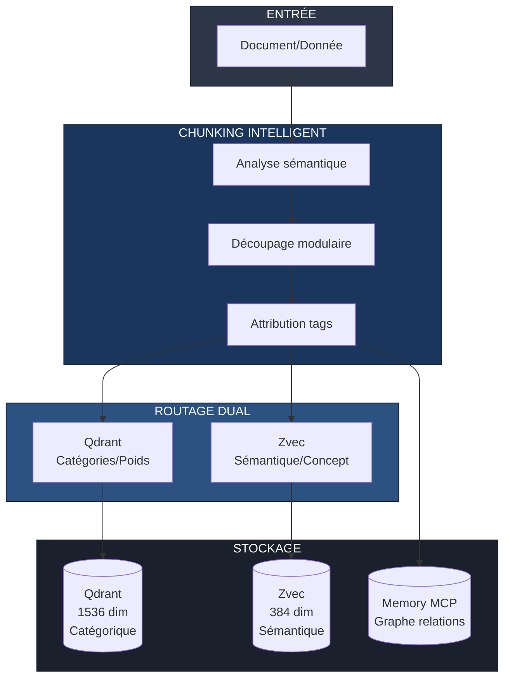
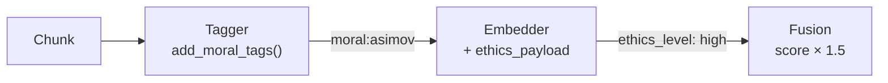

# Architecture RAG Modulaire - Hephaistos-Kit

**Version:** 2.0  
**Date:** 2026-04-06  
**Statut:** ✅ Opérationnel (Score: 100/100)

---

## Vue d'ensemble

Le système RAG utilise deux approches complémentaires pour maximiser la précision de recherche :



---

## Statut du Système (Audit 2026-04-03)

### Score Global: 100/100 ✅

| Indicateur | Valeur | Statut |
|------------|--------|--------|
| **Fichiers Python** | 16 | ✅ |
| **Lignes de code** | 4 642 | ✅ |
| **Classes** | 25 | ✅ |
| **Fonctions** | 125 | ✅ |
| **Erreurs critiques** | 0 | ✅ |

---

## Architecture Mémoire Intégrée

### Cache Runtime (v2.0 - Optimisé)

```
✅ semantic-cache-data/runtime-cache.db (MCP Cache Server)
✅ current_workspace/cache/runtime-cache.db (Système + Agents unifiés)
```

**Réduction:** 3 copies → 2 copies (-33%)

### Graph Memory (Complémentaire)

| Base | Entités | Observations | Relations | Usage |
|------|---------|--------------|-----------|-------|
| **memory_mcp.db** | 82 | 131 | 584 | Knowledge Graph riche |
| **graph-memory.db** | - | - | 530 | Traversals rapides |

### Vector Store (Dual)

| Store | Dimensions | Usage | Collections |
|-------|------------|-------|-------------|
| **Qdrant** | 1536D | Catégorique | code, doc, config, workflow, skill |
| **Zvec** | 384D | Sémantique | entities, concepts, actions, relations, context |

---

## Stratégie de Chunking

### Types de Chunks

| Type | Taille | Usage |
|------|--------|-------|
| **Atomic** | 50-100 tokens | Entités isolées |
| **Modular** | 200-500 tokens | Paragraphes cohérents |
| **Contextual** | 500-1000 tokens | Sections complètes |
| **Structural** | Variable | Code/fichiers |

### Règles de Découpage

1. Unité sémantique = 1 chunk
2. Préserver le contexte
3. Chevauchement 15%
4. Tags obligatoires
5. Taille par défaut: 512 tokens

---

## Système de Tags Unifié

```
TAGS
├── CATÉGORIQUE (Qdrant)
│   ├── type: [code, doc, config, data, log]
│   ├── domain: [frontend, backend, database, devops, security]
│   ├── scope: [project, module, function, variable]
│   └── priority: [critical, high, medium, low]
│
├── SÉMANTIQUE (Zvec)
│   ├── concept: [authentification, cache, api, workflow]
│   ├── action: [create, read, update, delete, validate]
│   ├── entity: [user, project, file, task, agent]
│   └── relation: [depends, implements, extends, contains]
│
└── CONTEXTUEL (Memory MCP)
    ├── temporal: [session, daily, weekly, permanent]
    ├── source: [user, agent, system, external]
    ├── confidence: [high, medium, low]
    └── access: [public, private, restricted]
```

---

## Routage Dual

| Contenu | Tags | Routage |
|---------|------|---------|
| `def authenticate_user()` | type:code, concept:auth | Qdrant + Zvec |
| `Configuration Redis` | type:config, domain:database | Qdrant uniquement |
| `Le chat mange` | concept:chat, entity:animal | Zvec uniquement |

---

## Recherche Hybride

### Scoring de Fusion

```python
def hybrid_score(qdrant_score, zvec_score, memory_boost):
    W_CAT = 0.5  # Poids catégorique
    W_SEM = 0.4  # Poids sémantique
    W_MEM = 0.1  # Poids relations
    
    return min(W_CAT * qdrant_score + W_SEM * zvec_score + W_MEM * memory_boost, 1.0)
```

### Métriques Cibles

| Métrique | Cible | Alerte |
|----------|-------|--------|
| Precision@10 | > 0.85 | < 0.70 |
| Recall@100 | > 0.90 | < 0.75 |
| Latence recherche | < 100ms | > 500ms |

---

## Filtre Moral Asimov (v2.1)

### Principe

Le système RAG intègre un filtre moral basé sur les lois d'Asimov pour prioriser les contenus éthiques.

### Flux de Traitement



### Mots-clés Détectés

| Catégorie | Mots-clés |
|-----------|-----------|
| **Asimov** | asimov, asimov's |
| **Loi** | loi, law, règle, rule |
| **Bien-être** | bien-être, welfare, well-being |
| **Nuire** | nuire, harm, blesser, damage |

### Implémentation

| Module | Méthode | Action |
|--------|---------|--------|
| `tagger.py` | `add_moral_tags()` | Ajoute tag `moral:asimov` |
| `embedder.py` | `store()` | Ajoute payload `{ethics_level: high, boost: 1.5}` |
| `fusion.py` | `fuse()` | Multiplie score par 1.5 si `ethics_level=high` |

---

## Documents de Référence

| Document | Chemin |
|----------|--------|
| Architecture complète | `.agent/memory/ARCHITECTURE-ANALYSIS.md` |
| Politiques | `.agent/memory/memory-policy.md` |
| Stratégie embedding | `.agent/knowledge/embeddings/embedding-strategy.md` |
| Système unifié | `.agent/memory/UNIFIED_MEMORY_SYSTEM.md` |
| Archives | `.agent/back-end/README.md` |
