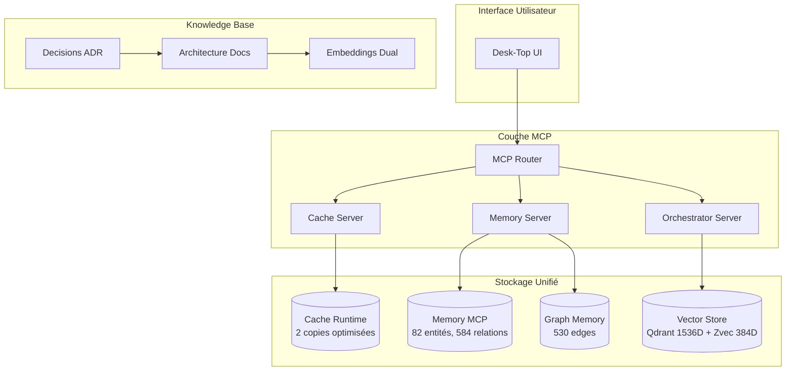

# Vue d'Ensemble du Système Cascade

**Version:** 2.0  
**Date:** 2026-04-06  
**Statut:** ✅ Opérationnel

---

## Architecture Globale

---

## Composants Principaux

### 1. Interface Utilisateur (Desk-Top)
- Interface web moderne avec React
- Accès direct aux configurations MCP
- Tableau de bord des agents
- Visualisation des connaissances

### 2. Couche MCP (Model Context Protocol)
- **Router**: Orchestration des requêtes
- **Cache**: Accès rapide aux données (2 copies optimisées)
- **Memory**: Gestion des connaissances (Knowledge Graph)
- **Orchestrator**: Coordination des agents

### 3. Stockage Unifié (v2.0)

#### Cache Runtime (Optimisé)
| Base | Entrées | Usage |
|------|---------|-------|
| semantic-cache-data/runtime-cache.db | 2 | MCP Cache Server |
| current_workspace/cache/runtime-cache.db | 150 | Système + Agents |

**Réduction:** 3 → 2 copies (-33%)

#### Graph Memory (Complémentaire)
| Base | Rôle | Données |
|------|------|---------|
| memory_mcp.db | Knowledge Graph | 82 entités, 131 observations, 584 relations |
| graph-memory.db | Traversals | 530 edges simples |

#### Vector Store (Dual)
| Store | Dimensions | Usage |
|-------|------------|-------|
| Qdrant | 1536D | Catégorique (code, doc, config) |
| Zvec | 384D | Sémantique (entities, concepts) |

### 4. Base de Connaissances
- **Architecture**: Documentation système
- **Decisions**: ADRs et choix techniques
- **Embeddings**: Représentations vectorielles dual

---

## Flux de Données

1. **Requête Utilisateur** → UI
2. **UI** → MCP Router
3. **Router** → Cache lookup
4. **Cache miss** → Vector Store (Qdrant/Zvec)
5. **Relations** → Memory MCP
6. **Résultat** → UI

---

## Sécurité

- Authentification JWT
- Chiffrement des données sensibles
- Isolation des agents
- Audit logging complet

---

## Performance

- Cache multi-niveaux (2 copies optimisées)
- Parallélisation des recherches (Qdrant + Zvec)
- Latence cible: <100ms (cache), <500ms (vector)
- Disponibilité: 99.9%

---

## Documents de Référence

| Document | Description |
|----------|-------------|
| `ARCHITECTURE-ANALYSIS.md` | Architecture complète multi-bases |
| `RAG-AUDIT-REPORT.md` | Audit système RAG (Score: 100/100) |
| `memory-policy.md` | Politiques de gestion |
| `CACHE-RUNTIME-UNIFICATION.md` | Optimisation caches |
| `GRAPH-MEMORY-CLARIFICATION.md` | Rôles graph-memory vs memory_mcp |
