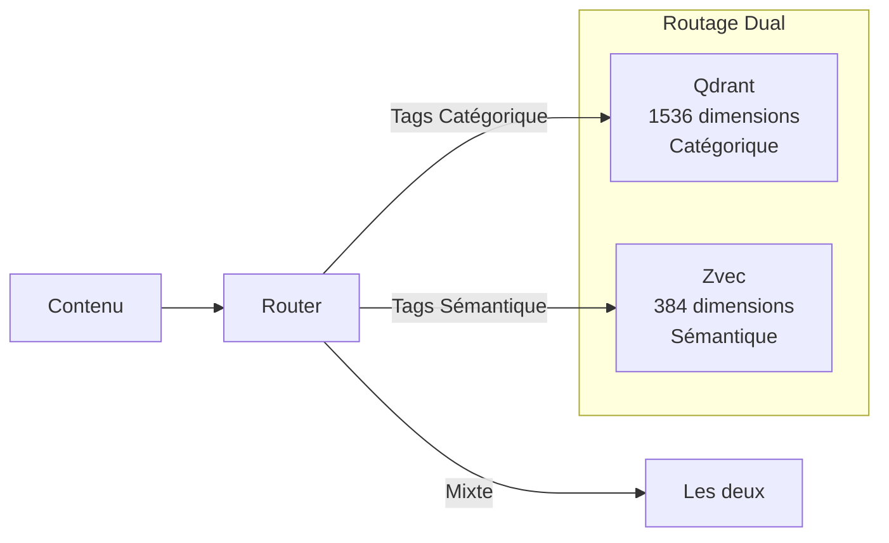
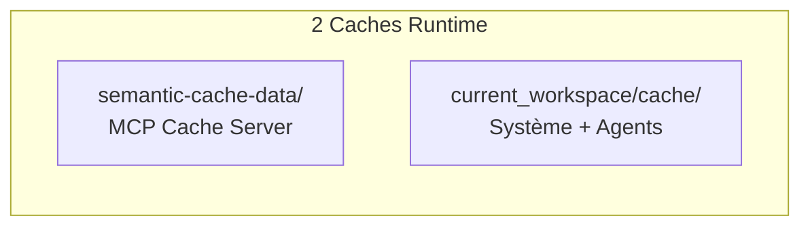

# Stratégie d'Embedding pour le Système Cascade

**Version:** 2.0  
**Date:** 2026-04-06  
**Statut:** ✅ Opérationnel

---

## Overview

Ce document décrit la stratégie d'embedding utilisée pour indexer et rechercher efficacement les connaissances dans le système Cascade.

---

## Architecture Dual-Store



---

## Modèles d'Embedding

### Store Principal: Qdrant (1536D - Catégorique)

| Paramètre | Valeur |
|-----------|--------|
| **Dimensions** | 1536 |
| **Provider** | Mistral |
| **Model** | codestral-embed-2505 |
| **Distance** | Cosine similarity |
| **Usage** | Tags catégoriques (type, domain, scope, priority) |

### Store Secondaire: Zvec (384D - Sémantique)

| Paramètre | Valeur |
|-----------|--------|
| **Dimensions** | 384 |
| **Provider** | Local |
| **Distance** | Cosine similarity |
| **Usage** | Tags sémantiques (concept, action, entity, relation) |

---

## Collections Vectorielles

### Qdrant (1536D - Catégorique)

| Collection | Type | Usage |
|------------|------|-------|
| `code_index` | Code | Fonctions, classes, modules |
| `doc_index` | Documentation | README, guides, API docs |
| `config_index` | Configuration | YAML, JSON, ENV |
| `workflow_index` | Workflows | n8n, automations |
| `skill_index` | Skills | Compétences agent |

### Zvec (384D - Sémantique)

| Collection | Concept | Usage |
|------------|---------|-------|
| `concepts_index` | Concepts | Idées, théories, patterns |
| `entities_index` | Entités | Objets, personnes, projets |
| `actions_index` | Actions | Verbes, opérations |
| `relations_index` | Relations | Liens, dépendances |
| `context_index` | Contexte | Sessions, historique |
| `learning_insights` | Apprentissage | Insights système |

---

## Types de Contenu

### 1. Code Source
```json
{
  "type": "code",
  "chunk_size": 512,
  "overlap": 77,
  "metadata": {
    "file_path": "string",
    "language": "string",
    "function_name": "string",
    "class_name": "string",
    "line_range": [start, end],
    "tags": {
      "categorique": {"type": "code", "domain": "backend"},
      "semantique": {"concept": "auth", "action": "validate"}
    }
  }
}
```

### 2. Documentation
```json
{
  "type": "documentation",
  "chunk_size": 500,
  "overlap": 50,
  "metadata": {
    "title": "string",
    "section": "string",
    "tags": {
      "categorique": {"type": "doc", "scope": "module"},
      "semantique": {"concept": "tutorial"}
    }
  }
}
```

### 3. Décisions d'Architecture (ADR)
```json
{
  "type": "adr",
  "chunk_size": 800,
  "overlap": 0,
  "metadata": {
    "adr_id": "string",
    "status": "string",
    "date": "datetime",
    "tags": {
      "categorique": {"type": "doc", "priority": "high"},
      "semantique": {"concept": "architecture"}
    }
  }
}
```

---

## Pipeline d'Indexation

### 1. Extraction
- Identification des fichiers et contenus à indexer
- Extraction des métadonnées
- Découpage en chunks intelligents

### 2. Tagging
- **Tags Catégoriques** → Routage Qdrant
- **Tags Sémantiques** → Routage Zvec
- **Tags Mixtes** → Routage dual

### 3. Embedding
- Génération des vecteurs 1536D (Qdrant)
- Génération des vecteurs 384D (Zvec)
- Validation de la qualité

### 4. Stockage
- Indexation dans Qdrant/Zvec
- Relations dans Memory MCP
- Mise à jour du cache

---

## Stratégies de Recherche

### 1. Recherche Hybride
```python
def hybrid_score(qdrant_score, zvec_score, memory_boost):
    """
    Score combiné pour résultat hybride
    """
    W_CAT = 0.5  # Poids catégorique
    W_SEM = 0.4  # Poids sémantique
    W_MEM = 0.1  # Poids relations
    
    score = (
        W_CAT * qdrant_score +
        W_SEM * zvec_score +
        W_MEM * memory_boost
    )
    
    return min(score, 1.0)
```

### 2. Recherche par Similarité de Code
```python
code_similarity = {
    "code_snippet": "function authenticate(token) { ... }",
    "language": "javascript",
    "collections": ["code_index", "concepts_index"],
    "max_distance": 0.5
}
```

---

## Cache Runtime (v2.0 - Optimisé)



| Base | Entrées | Usage |
|------|---------|-------|
| semantic-cache-data/runtime-cache.db | 2 | MCP Cache Server |
| current_workspace/cache/runtime-cache.db | 150 | Système + Agents |

**Optimisation:** 3 copies → 2 copies (-33%)

---

## Monitoring

### Métriques
| Métrique | Cible | Alerte |
|----------|-------|--------|
| Precision@10 | > 0.85 | < 0.70 |
| Recall@100 | > 0.90 | < 0.75 |
| Latence recherche | < 100ms | > 500ms |
| Couverture tags | > 95% | < 80% |

### Alertes
- Dégradation de la qualité > 10%
- Latence > 500ms
- Espace de stockage > 90%

---

## Documents de Référence

| Document | Description |
|----------|-------------|
| `ARCHITECTURE-ANALYSIS.md` | Architecture complète multi-bases |
| `UNIFIED_MEMORY_SYSTEM.md` | Système de mémoire unifié (v2.1) |
| `memory-policy.md` | Politiques de gestion |
| `back-end/README.md` | Archives et historique des changements |
