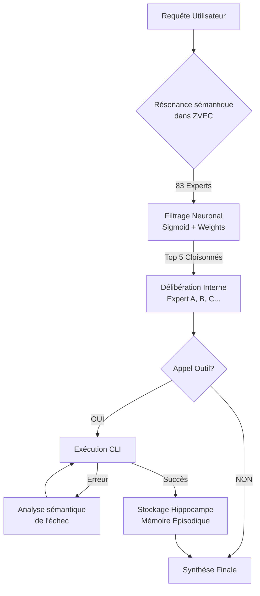
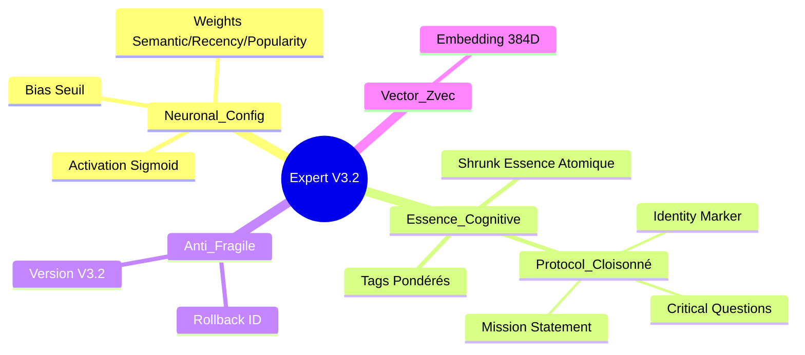

# Feature: Pipeline Jiminy Enrichi (Sémantique + Casquettes)

## Objectif
Mettre en place un pipeline capable d'enrichir n'importe quel fichier ou tâche en appliquant séquentiellement des "casquettes" (personnalités/protocoles) sélectionnées par recherche sémantique.

## Fonctionnement
1. **Ingestion** : Tous les prompts de personnalité (83+) sont indexés avec :
   - `shrink` : Essence atomique.
   - `tags` : Mots-clés facilitant la recherche.
   - `summary` : Rôle et protocole du prompt.
2. **Matching Sémantique** : Une tâche (ex: "Jeu Snake HTML") est analysée par similarité cosinus par rapport aux index des prompts.
3. **Pipeline Casquettes** : Les personnalités sélectionnées sont appliquées une à une sur le fichier cible.
4. **Artefacts** : Chaque passage génère un fichier de perspective structuré dans le dossier projet.

## Statut
- [x] Initialisation du périmètre feature
- [ ] Contrats de données JSON
- [ ] Ingestion des prompts enrichie
- [ ] Recherche sémantique de personnalités
- [ ] Runner de pipeline multi-casquettes

## Mise à jour V3.2 - Conscience Cloisonnée (2026-04-11)
- **Architecture MoE Haute Fidélité** : Implémentation du protocole [IDENTITÉ : NOM] pour éviter la dilution de l'expertise.
- **Schéma Neuronal Avancé** : Intégration des configurations Sigmoid, Weights et Bias dans chaque entité.
- **Mémoire Épisodique Isolée** : Système de souvenirs (thoughts) vectorisés avec auto-indexation.
- **ZVEC Intelligent** : Embeddings pré-calculés stockés à la source pour une résonance instantanée.
- **Flux de Conscience** : Intégration d'une boucle d'auto-correction sémantique sur échec des outils.

### Visualisation de l'Architecture V3.2

#### 1. L'Entonnoir de Conscience (Flux Opérationnel)

#### 2. Anatomie d'une Casquette (Structure de l'Expert)
Chaque expert est désormais une cellule autonome et vectorisée :

- **Anti-Fragilité** : Système de backup (BACKUP_ZVEC) et rollback_id par session.
